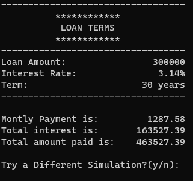
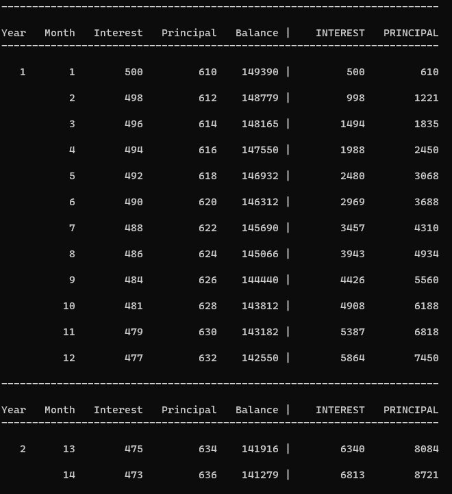
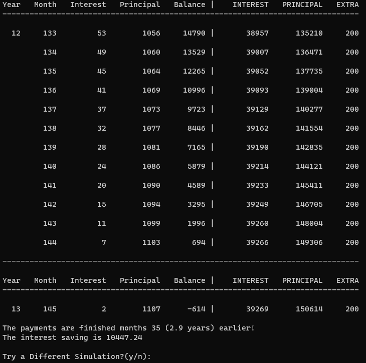

# Mortgage-Calculator

In this project, you will write a program that analyzes mortgage loan payments. A mortgage loan is taken  to buy a house but a loan with similar terms applies for buying cars. The goal of this project is to allow the user to analyze the payments such as the monthly payment and the total interest paid. Another aspect is that the borrower is allowed to make extra payments towards the capital. This allows the loan to be paid earlier and the total amount of interest to be reduced. The program will let the user analyze such scenarios.

## The parameters of a mortgage loan are shown in the table below.

 - Loan Parameters Definition Example
 - Loan amount (the principal) Amount borrowed from the bank $150,000
 - Interest rate Interest charged yearly 4%
 - Term Time duration until the loan is paid back 15 years (180 months)
 - The nominal interest rate, 4% in the example, is a yearly interest rate. This rate is divided by 12 to obtain the monthly interest rate. The monthly interest rate is 4/12 = 0.33%. This means the bank charges 0.33% on the outstanding capital amount each month.

For the first month, the outstanding amount is $150,000. Therefore, the borrower is charged 0.33% * $150,000 = $495. In later months, the remaining capital goes down. Let’s say after a few years of paying, the outstanding capital is $100,000. For that month, the borrower is charged 0.33% * $100,000 = $330 of interest. We can see that the amount of interest paid goes down as the borrower progresses in making payments.

The magic of loan arithmetic is to have the borrower pay a fixed monthly amount over the lifetime of the loan. This amount is derived by the equation below. The term L is the total loan amount. The term m_rate is the monthly interest rate (0.33% in our example). The term months is the total loan duration in months (180 months in our example).

```P = L * m_rate * (1+m_rate)^months / [ ((1+m_rate)^months) - 1 ]```

Plugging the numbers of our example gives a monthly payment amount of $1,109.53. In the first month, we already computed that the interest payment is $495. The remaining ($1,109.53 - $495) = $614.53 

- 2 - applies to the loan capital. After this payment is made, the borrower owes the bank ($150,000 - $614.53) = $149,385.47.

At a later time, let’s say the borrower still owes $100,000. We computed above that the interest would be $330. Accordingly, in that month, an amount of ($1,109.53 - $330) = $779.53 is applied to the loan capital. Moving forward, the borrower owes $100,000 - $779.53 = $99,220.47. 

From these two examples, we can see that the user pays a fixed monthly amount over the lifetime of the loan. However, as the loan payment progresses, the portion applied to interest decreases and the portion applied to the capital increases. The magic of the formula is that the bank keeps charging the interest rate on the outstanding capital each month and the loan is fully paid off by the end of the term while the borrower pays a fixed amount.

Output #1 (Short Format)
Write a function that takes the loan terms as input and prints the monthly payment and the information shown below. Below is the header of the function and the output for our example loan. Your function should print all the information shown and the numbers should be right aligned.

```void output_short_format(double loan_amount, double interest_rate, double term_years);```

 

Output #2 (Amortized Schedule)
The amortized schedule shows the amounts that go towards interest and principal for each month. Write a function that takes the loan terms as parameters and prints the amortized schedule. The function header and a sample output are shown below. The rightmost two columns (INTEREST, PRINCIPAL) are cumulative figures and show the total interest and principal paid to date. Like the sample below, print the year number only for the first month of the year and print the header again for each year. The format should be easy to read (i.e., right align the numbers and the text).
```void output_amortized(double loan_amount, double interest_rate, double term_years); ```

- 3 -
 


Output #3 (Early Payments: monthly)
The loan terms usually allow the borrower to make early payments towards the capital. This allows the loan to be paid off earlier and reduces the total amount of interest paid. Let’s say, for our example loan, the remaining capital is $50,000. In this month, the borrower makes the monthly payment of $1,109.53 and, on top of that, makes an extra payment of $1,000 towards the capital.
Let’s do the math. The bank first charges 0.33% interest on the outstanding capital. This amounts to $50,000 * 0.33% = $165. The remaining amount of the monthly payment goes towards capital, which is: ```$1,109.52 - $165 = $944.53.```

On top of that, the borrower contributes $1,000 towards the capital, for a total of $1,944.53. Moving forward, the capital amount remaining is $50,000 - $1,944.53 = $48,055.47. Note that the interest is charged on the capital before subtracting the extra capital amount. By applying early payments, the capital amount is reduced at a faster pace and, therefore, the loan will 
paid off before 180 months. Write a function that takes the loan terms as input and prints the amortized schedule whereby an extra payment towards capital is applied each month. The monthly extra payment is also an input to the function. In the sample below, the borrower pays an extra $200 towards capital each month, shown in the rightmost column.

- 4 -
The output shows that after the first month of the 13th year, the balance falls below zero, which means the loan is paid off. It was paid off 35 months earlier and resulted in a saving of interest of $10,447. Your output should reproduce all the information shown in the sample. Below is the header of the function.

```void output_extra_monthy(double loan_amount, double interest_rate, double term_years, double extra);```
 

- 5 -
Output #4 (Early Payments: yearly)
Write a function similar to the previous one where the user makes one extra payment per year (in December). The function header is shown below. The sample files attached show the output.

```void output_extra_yearly(double loan_amount, double interest_rate, double term_years, double extra);```

Grading criteria (5 pts)
Correctness (1 pt)
The program should produce the correct numbers. Use the attached samples to test your program. You can also search for mortgage calculators on the web to compare your answers to. Include four output files of a (different) loan similar to the four files included with the project.
Code style (1 pt)
Your code should be split into functions (as recommended above). You can add more functions to make the code modular. The code should be indented and should be easy to read. The variable names should reflect what they hold.
User friendliness (1 pt)
Make your program user friendly. Create a menu for your program so the user selects the desired output. All the numbers printed should be right-aligned for ease of reading.
The functions system(“cls”); or clrscr(); are useful for clearing the screen when transitioning between menu pages.
Case Studies (1 pt)
Use your program to analyze the case studies below. 

1) What difference does it make in the monthly payment and total interest if the loan duration is 15 years 
vs 30 years? (these are the two common durations for a house mortgage).
2) Does it make a big difference if the interest rate changes from 3% to 4%? (check for 15-year and 30-
year terms)
3) Does it make a big difference in the monthly payment and total interest if the loan amount changes 
from $150,000 to $160,000? (check for 15-year and 30-year terms)
4) What difference to the total interest and total time do extra (monthly or yearly) payments do?
5) How small does the interest become for car loans (eg: loan amount $15,000)?

Assessing your Program’s Usefulness (1 pt)
Demo your program to a friend or relative who doesn’t work in or study computing. Report whether they were able to use your program and whether they found it useful. Report if they recommended any new features. The goal is to assess whether your programming knowledge can be used to build a useful product.

- 6 -
Deliverables
• Your code file(s) and executable.
• Four sample output files (similar to those provided to you, but on a different loan)
• Report: answers the case studies and includes feedback on your program’s usefulness.

Capturing the Output
Option #1: Copy/Paste in Windows
This program produces a lot of output. It may be helpful to increase the window and buffer size to prevent the output from disappearing at the top of the window. To do so, click on the top left of the program window and select Properties. Then increase the window and buffer size (shown in the figures) so the buffer stores all the output and you’re able to scroll up to it.
Restart the program and the changes should take effect.

- 7 -
In order to copy the windows content, click on the top left corner and navigate to Mark as shown in the figure. This allows you to select the windows content. Once the content is selected, simply right click on it which serves as Copy. Then paste the text in a different file. When you copy the output to an editor (e.g. Microsoft Word), if the numbers aren’t aligned anymore, 
change the font to a fixed-width font such as Courier New.

- 8 -
Option #2: Print to a file directly
See the attached sample code that prints to a file.
Option #3: Redirect the output to a file
Run the executable from the command line (works for Windows, Mac and Linux) as the following:
myprogram.exe > file.txt
The > sign means the output goes to the file “file.txt” instead of the monitor. To run the program from the command line, open the terminal (in Mac or Linux) or type “cmd” in Windows Quickstart. Then, navigate to the folder that contains the executable and type the command above. Ask the instructor if you need help doing this.
